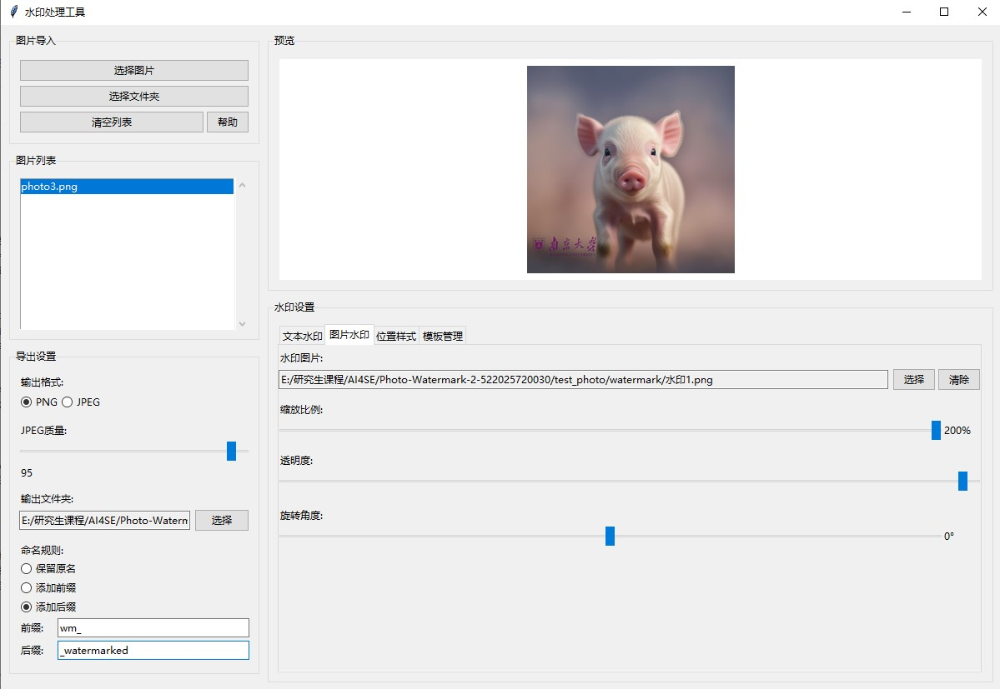

# Windows本地水印处理应用

一个功能完整的Windows本地水印处理工具，支持文本和图片水印，批量处理，实时预览等功能。

## 界面展示
  

## 下载方式 
* 在Release中下载压缩包
* 解压后点击exe文件运行，注意窗口要打开全屏！！

## 功能特性
### 1. 文件处理
- **导入图片**：支持单张图片拖拽或通过文件选择器导入
- **批量导入**：可一次性选择多张图片或直接导入整个文件夹
- **图片列表**：在界面上显示已导入图片的列表（缩略图和文件名）

### 2. 支持格式
- **输入格式**：JPEG, PNG, BMP, TIFF
- **PNG透明通道**：完全支持PNG格式的透明通道
- **输出格式**：用户可选择输出为JPEG或PNG

### 3. 导出功能
- **输出文件夹**：用户可指定输出文件夹
- **防覆盖保护**：默认禁止导出到原文件夹
- **文件命名规则**：
  - 保留原文件名
  - 添加自定义前缀（如 wm_）
  - 添加自定义后缀（如 _watermarked）
- **JPEG质量调节**：提供图片质量（压缩率）调节滑块（0-100）

### 4. 水印类型

#### 4.1 文本水印
- **自定义文本**：用户可输入任意文本内容
- **字体设置**：可选择系统字体、字号、粗体、斜体
- **颜色选择**：提供调色板选择字体颜色
- **透明度调节**：可调节文本透明度（0-100%）
- **样式效果**：支持阴影和描边效果，增强可读性

#### 4.2 图片水印
- **本地图片**：用户可选择本地图片（如Logo）作为水印
- **透明支持**：完全支持带透明通道的PNG图片
- **缩放调节**：可按比例调整图片水印的大小
- **透明度调节**：可调节图片水印的整体透明度（0-100%）

### 5. 水印布局与样式
- **实时预览**：所有水印调整都在主预览窗口中实时显示
- **图片切换**：可点击图片列表切换预览不同图片
- **预设位置**：提供九宫格布局（四角、正中心）
- **手动拖拽**：可在预览图上直接拖拽水印到任意位置
- **旋转功能**：提供滑块允许任意角度旋转水印

### 6. 配置管理
- **水印模板**：可保存当前所有水印设置为模板
- **模板管理**：可加载、管理和删除已保存的模板
- **自动保存**：程序启动时自动加载上次关闭时的设置

## 安装和运行

### 方式一：直接使用（推荐）
1. 双击运行 `一键打包.bat` 进行打包
2. 打包完成后获得 `水印处理工具_发布版` 文件夹
3. 双击 `水印处理工具.exe` 即可运行，无需Python环境

### 方式二：开发环境运行
1. 确保已安装Python 3.7+
2. 安装依赖包：`pip install -r requirements.txt`
3. 运行应用：`python watermark_app.py`

## 使用说明

### 基本使用流程
1. **导入图片**：点击"选择图片"或"选择文件夹"导入要处理的图片
2. **设置水印**：在右侧面板中设置文本或图片水印
3. **调整位置**：使用预设位置或直接在预览区域拖拽水印
4. **配置导出**：设置输出格式、文件夹和命名规则
5. **批量导出**：点击"批量导出"开始处理

### 界面布局
- **左侧面板**：图片导入、列表显示、导出设置
- **右侧面板**：预览区域和水印设置选项卡
  - 文本水印：文本内容、字体、颜色、效果设置
  - 图片水印：水印图片选择、缩放、透明度设置
  - 位置样式：九宫格位置、旋转角度设置
  - 模板管理：保存、加载、删除水印模板

### 高级功能
- **实时预览**：所有设置更改都会立即在预览区域显示
- **批量处理**：支持一次性处理多张图片
- **进度显示**：导出时显示处理进度和状态
- **模板系统**：保存常用水印设置，提高工作效率

## 技术特性
- 基于Python tkinter构建的原生GUI
- 使用PIL/Pillow进行图像处理
- 支持多线程导出，避免界面卡顿
- 完整的错误处理和用户提示
- 自动保存用户设置和偏好

## 注意事项
- 建议使用PNG格式输出以保持最佳质量
- 大批量处理时请耐心等待
- 水印位置可通过拖拽精确调整
- 模板功能可大大提高重复工作的效率

## 故障排除
如果遇到问题，请检查：
1. Python版本是否为3.7+
2. 是否正确安装了Pillow库
3. 图片文件是否损坏或格式不支持
4. 输出文件夹是否有写入权限
